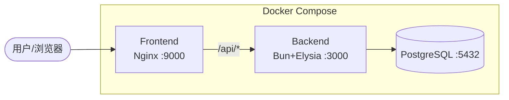

# Phase 6: Docker 化 + 文档 - Research

**Researched:** 2026-04-20
**Domain:** Docker multi-stage builds, docker-compose production hardening, deployment scripts, documentation
**Confidence:** HIGH

## Summary

Phase 6 将现有的"能跑"级 Docker 配置升级为生产级：后端 Dockerfile 重写为真·多阶段构建（builder 仅安装依赖 + prisma generate，runner 仅复制必要文件）；前端 Dockerfile 从 node+npm 切换到 Bun 构建链；docker-compose 增加 healthcheck、logging、depends_on condition 强化；编写完整 README 和 Bash+PowerShell 双份部署脚本。

当前后端 Dockerfile 的主要问题是 `COPY --from=builder /app /app` 把整个 builder 阶段（含 devDependencies、源码、构建缓存）全部复制到 runner，导致镜像臃肿。前端 Dockerfile 使用 `node:20-alpine` + `npm install --legacy-peer-deps`，与项目 Bun 技术栈不一致。两个 Dockerfile 均缺少 HEALTHCHECK 指令。docker-compose 缺少 logging 配置和 frontend 的 healthcheck depends_on。

**Primary recommendation:** 按 D-01~D-13 决策逐项实施，重点关注 Prisma binaryTargets 配置（Alpine musl 兼容）和前端 Bun+Quasar 构建链的验证。

<user_constraints>
## User Constraints (from CONTEXT.md)

### Locked Decisions
- **D-01:** 后端 Dockerfile 改为真·多阶段构建（保留源码模式）：builder 阶段 `bun install` + `prisma generate`；runner 阶段仅复制 `src/`、`prisma/`、`package.json`、`node_modules/.prisma`，不复制整个 `/app`
- **D-02:** 前端 Dockerfile 切换到 Bun 构建链：builder 阶段 `oven/bun:1.3-alpine` + `bun install` + `bun run build`（quasar build）；runner 阶段保持 `nginx:1.27-alpine`。去掉 `npm install --legacy-peer-deps`
- **D-03:** 前后端 Dockerfile 均内置 `HEALTHCHECK` 指令：后端 `curl -f http://localhost:3000/health`；前端 `wget -qO /dev/null http://localhost:80/`
- **D-04:** 不配置资源限制（mem_limit/cpus），保持简单
- **D-05:** 所有 service 配置 logging driver：`json-file`，`max-size: 10m`，`max-file: "3"`
- **D-06:** frontend depends_on backend 改为 `condition: service_healthy`（需后端 healthcheck 就绪）
- **D-07:** 不配 profiles，不区分 dev/prod。`docker compose up -d` 一条命令启动全部
- **D-08:** README 完整档：架构图（Mermaid）+ 默认端口表 + 反向代理/HTTPS 示例 + 备份恢复 + 故障排查 FAQ + 升级流程 + 贡献指南 + 截图/GIF
- **D-09:** 只写中文（技术词/命令保留英文原文）
- **D-10:** 架构图使用 Mermaid 代码块
- **D-11:** 双份脚本：`scripts/*.sh`（Bash）+ `scripts/*.ps1`（PowerShell），功能对等
- **D-12:** 脚本覆盖 4 类操作：init / backup+restore / upgrade / health
- **D-13:** 专用 `check-env` 脚本：检查 `.env` 存在、JWT_SECRET 长度 ≥32 且非默认值、POSTGRES_PASSWORD 非默认值

### Claude's Discretion
- 后端 runner 阶段是否需要额外 apk 包（如 openssl）
- Mermaid 架构图的具体布局与节点命名
- 反向代理示例选 Caddy 还是 Nginx（或两者都给）
- 截图/GIF 的具体内容与放置位置
- 脚本内部的错误提示措辞与颜色输出
- backup 文件保留天数策略

### Deferred Ideas (OUT OF SCOPE)
- 镜像发布到 Docker Hub / GHCR + CI 自动构建
- compose 内置反向代理容器（Caddy/Traefik）
- 备份定时策略（cron container）
- docker-compose.override.yml 开发模式
</user_constraints>

<phase_requirements>
## Phase Requirements

| ID | Description | Research Support |
|----|-------------|------------------|
| NFR-2 | 安全：HTTPS 由反向代理终止；JWT secret 至少 32 字符；防 SQL 注入 | D-13 check-env 脚本校验 JWT_SECRET ≥32 + 非默认值；README 反向代理/HTTPS 示例；后端已有启动校验 |
| NFR-4 | 部署：`docker compose up -d` 一条命令启动 | D-01~D-07 Dockerfile + compose 强化；D-11~D-13 部署脚本；D-08 README 部署文档 |
</phase_requirements>

## Standard Stack

### Core
| Library/Tool | Version | Purpose | Why Standard |
|-------------|---------|---------|--------------|
| oven/bun | 1.3-alpine | 后端 builder + runner 基础镜像 | 项目技术栈，Alpine 变体自 2024.11 起使用 musl build |
| nginx | 1.27-alpine | 前端 SPA 静态托管 | 轻量、稳定、Alpine 内置 wget 可做 healthcheck |
| postgres | 16-alpine | 数据库（已有） | 项目已选定 |
| docker compose | v2.40+ | 服务编排 | 本地已安装 v2.40.3 |

### Supporting
| Tool | Purpose | When to Use |
|------|---------|-------------|
| pg_dump / pg_restore | 数据库备份恢复 | backup/restore 脚本中调用 |
| openssl (apk) | Prisma 运行时依赖 | 后端 runner 阶段需要（当前 Dockerfile 已安装） |
| curl (apk) | 后端 HEALTHCHECK | oven/bun:alpine 不含 curl，需 apk add |

### Alternatives Considered
| Instead of | Could Use | Tradeoff |
|------------|-----------|----------|
| oven/bun:1.3-alpine (前端 builder) | node:20-alpine | 与后端技术栈不一致，但 Quasar+Bun 构建兼容性需验证 |
| curl (后端 healthcheck) | wget 或 bun 内置 fetch | curl 需额外安装；wget Alpine 自带；bun fetch 需写脚本 |

**Installation:** 无额外 npm 包需求，所有工具通过 Docker 镜像和 apk 获取。

## Architecture Patterns

### Recommended Project Structure
```
.
├── backend/
│   ├── Dockerfile          # 真·多阶段构建
│   ├── .dockerignore       # 新增
│   └── ...
├── frontend/
│   ├── Dockerfile          # Bun 构建链
│   ├── .dockerignore       # 新增
│   ├── nginx.conf          # 已有
│   └── ...
├── scripts/
│   ├── init.sh             # 新增
│   ├── init.ps1            # 新增
│   ├── backup.sh           # 新增
│   ├── backup.ps1          # 新增
│   ├── restore.sh          # 新增
│   ├── restore.ps1         # 新增
│   ├── upgrade.sh          # 新增
│   ├── upgrade.ps1         # 新增
│   ├── health.sh           # 新增
│   ├── health.ps1          # 新增
│   ├── check-env.sh        # 新增
│   └── check-env.ps1       # 新增
├── docker-compose.yml      # 强化
├── .env.example            # 已有
└── README.md               # 扩充
```

### Pattern 1: 后端真·多阶段构建（保留源码模式）
**What:** builder 阶段安装依赖 + prisma generate；runner 阶段仅复制运行必需文件
**When to use:** Bun 直跑 TypeScript，不做 bundle（避免 Prisma 动态 require 兼容问题）
**Example:**
```dockerfile
# Source: Bun official Docker guide + project D-01 decision
FROM oven/bun:1.3-alpine AS builder
WORKDIR /app
COPY package.json bun.lock ./
COPY prisma ./prisma
RUN bun install --frozen-lockfile
RUN bunx prisma generate

FROM oven/bun:1.3-alpine
WORKDIR /app
RUN apk add --no-cache curl openssl
COPY --from=builder /app/node_modules/.prisma ./node_modules/.prisma
COPY --from=builder /app/node_modules/@prisma ./node_modules/@prisma
COPY --from=builder /app/node_modules ./node_modules
COPY package.json ./
COPY src ./src
COPY prisma ./prisma
ENV NODE_ENV=production
EXPOSE 3000
HEALTHCHECK --interval=30s --timeout=5s --start-period=10s --retries=3 \
  CMD curl -f http://localhost:3000/health || exit 1
CMD ["sh", "-c", "bunx prisma migrate deploy && bun run prisma/seed.ts && bun run src/index.ts"]
```

**Note on node_modules 复制策略:** D-01 要求 runner 仅复制 `node_modules/.prisma`，但后端运行时还需要 elysia、bcryptjs 等生产依赖。有两种方案：
1. 在 runner 阶段重新 `bun install --production`（更干净，但增加构建时间）
2. 从 builder 复制整个 `node_modules` 但排除 devDependencies（通过 builder 中先 production install）

推荐方案 1：builder 做 full install（含 devDeps 用于 prisma generate），然后在 runner 阶段做 production-only install + 从 builder 复制 .prisma client。

### Pattern 2: 前端 Bun 构建链 + Nginx
**What:** 用 Bun 替代 Node+npm 做前端构建，产物仍由 Nginx 托管
**When to use:** 统一技术栈，加速依赖安装
**Example:**
```dockerfile
# Source: D-02 decision + Quasar SPA build pattern
FROM oven/bun:1.3-alpine AS builder
WORKDIR /app
ARG VITE_API_BASE
ENV VITE_API_BASE=${VITE_API_BASE}
COPY package.json bun.lock ./
RUN bun install --frozen-lockfile
COPY . .
RUN bun run build

FROM nginx:1.27-alpine
COPY --from=builder /app/dist/spa /usr/share/nginx/html
COPY nginx.conf /etc/nginx/conf.d/default.conf
EXPOSE 80
HEALTHCHECK --interval=30s --timeout=5s --start-period=5s --retries=3 \
  CMD wget --no-verbose --tries=1 --spider http://localhost/ || exit 1
```

**关键点:** `bun run build` 实际执行 package.json 中的 `quasar build` 脚本。Quasar CLI 自 2025 年初已支持 bun.lock 检测（PR #17775）。nginx:alpine 自带 wget，无需安装 curl。

### Pattern 3: docker-compose 生产强化
**What:** 为所有服务添加 healthcheck、logging、depends_on condition
**Example:**
```yaml
# Source: D-05/D-06 decisions + Docker Compose best practices
services:
  backend:
    # ... existing config ...
    healthcheck:
      test: ["CMD", "curl", "-f", "http://localhost:3000/health"]
      interval: 30s
      timeout: 5s
      start_period: 10s
      retries: 3
    logging:
      driver: json-file
      options:
        max-size: "10m"
        max-file: "3"

  frontend:
    depends_on:
      backend:
        condition: service_healthy
    healthcheck:
      test: ["CMD", "wget", "--no-verbose", "--tries=1", "--spider", "http://localhost/"]
      interval: 30s
      timeout: 5s
      start_period: 5s
      retries: 3
    logging:
      driver: json-file
      options:
        max-size: "10m"
        max-file: "3"
```

### Anti-Patterns to Avoid
- **COPY --from=builder /app /app:** 把整个 builder 阶段复制到 runner，包含 devDependencies 和构建缓存，镜像臃肿
- **不设 .dockerignore:** node_modules、.git、.env 等被 COPY 进镜像，增大体积且泄露敏感信息
- **HEALTHCHECK 用 curl 但不安装:** Alpine 镜像默认不含 curl，nginx:alpine 有 wget 但无 curl
- **depends_on 不加 condition:** 仅保证容器启动顺序，不保证服务就绪

## Don't Hand-Roll

| Problem | Don't Build | Use Instead | Why |
|---------|-------------|-------------|-----|
| 随机密码生成 | 自写随机函数 | `openssl rand -base64 32`（Bash）/ `[System.Web.Security.Membership]::GeneratePassword()`（PS） | 密码学安全随机 |
| 数据库备份 | 自写 SQL 导出 | `pg_dump` / `pg_restore` | 标准工具，处理所有边界情况 |
| 环境变量校验 | 复杂正则 | 简单字符串长度 + 默认值比对 | 够用即可，不过度工程 |
| 容器健康检查 | 自写 TCP 探测 | Docker HEALTHCHECK + curl/wget | 原生集成，compose depends_on 可感知 |
| 架构图 | 手画 PNG | Mermaid 代码块 | GitHub 自动渲染，可维护 |

**Key insight:** 部署脚本的核心价值是自动化重复操作和防止人为错误（如忘记改默认密码），不是实现复杂逻辑。保持脚本简单直接。

## Common Pitfalls

### Pitfall 1: Prisma binaryTargets 与 Alpine musl
**What goes wrong:** `oven/bun:1.3-alpine` 自 2024.11 (PR #15241) 起使用 musl build。Prisma 的 `native` target 会自动检测为 `linux-musl-*`。但如果开发机是 Windows/macOS，`native` 只匹配本地平台，Docker 构建时需要 musl 变体。
**Why it happens:** Prisma 根据 `/etc/os-release` 和 libc 类型选择 engine binary。当前 schema.prisma 未配置 binaryTargets，依赖自动检测。
**How to avoid:** 在 `schema.prisma` 的 generator 块中显式添加 `binaryTargets = ["native", "linux-musl-openssl-3.0.x"]`，确保本地开发和 Docker 构建都能找到正确的 engine。
**Warning signs:** `prisma generate` 或 `prisma migrate deploy` 报错 "Query engine library for current platform could not be found"

### Pitfall 2: 前端 Bun + Quasar 构建兼容性
**What goes wrong:** `bun run build`（即 `quasar build`）可能因 Quasar CLI 对 Bun 的支持不完整而失败。
**Why it happens:** Quasar 的 bun.lock 支持在 2025 年初才合入（PR #17775），部分 postinstall 脚本可能不兼容。
**How to avoid:** 确保 `bun install` 成功后再 `bun run build`。如果 Bun 构建失败，回退方案是在 builder 阶段用 `node:20-alpine` + `npm install`。
**Warning signs:** `bun install` 时 postinstall 脚本报错；`quasar build` 找不到 CLI

### Pitfall 3: HEALTHCHECK 工具缺失
**What goes wrong:** 后端 Dockerfile 用 `curl -f http://localhost:3000/health` 但 `oven/bun:alpine` 不含 curl。
**Why it happens:** Alpine 最小化镜像不预装 curl。
**How to avoid:** 后端 runner 阶段 `apk add --no-cache curl`（当前 Dockerfile 已装 openssl，加上 curl 即可）。或改用 wget（Alpine 自带）。
**Warning signs:** 容器启动后 healthcheck 持续 unhealthy

### Pitfall 4: seed 脚本重复执行
**What goes wrong:** CMD 中 `bun run prisma/seed.ts` 每次容器重启都执行，可能导致数据重复。
**Why it happens:** seed 脚本通常用 `upsert` 或 `createMany` 但如果用 `create` 会报唯一约束冲突。
**How to avoid:** 确认 seed.ts 使用 `upsert` 模式（幂等）。或将 seed 从 CMD 移到 init 脚本中，仅首次部署执行。
**Warning signs:** 容器重启后报 "Unique constraint failed" 错误

### Pitfall 5: .env 文件泄露到镜像
**What goes wrong:** 没有 .dockerignore，`COPY . .` 把 `.env` 复制进镜像。
**Why it happens:** 开发者忘记创建 .dockerignore。
**How to avoid:** 为 backend/ 和 frontend/ 各创建 .dockerignore，排除 node_modules、.env、.git 等。
**Warning signs:** `docker history` 显示镜像层包含敏感文件

### Pitfall 6: PowerShell 脚本编码与换行符
**What goes wrong:** 在 Windows 上创建的 .sh 脚本包含 CRLF 换行符，Linux 容器内执行报错。
**Why it happens:** Git 在 Windows 上默认 `core.autocrlf=true`。
**How to avoid:** .sh 文件在 .gitattributes 中强制 LF：`*.sh text eol=lf`。
**Warning signs:** `exec format error` 或 `\r: command not found`

## Code Examples

### .dockerignore（后端）
```
# Source: Bun official Docker guide
node_modules
Dockerfile*
docker-compose*
.dockerignore
.git
.gitignore
.env
.env.*
coverage
dist
*.log
```

### .dockerignore（前端）
```
node_modules
Dockerfile*
docker-compose*
.dockerignore
.git
.gitignore
.env
.env.*
dist
.quasar
coverage
*.log
```

### init.sh 核心逻辑
```bash
#!/usr/bin/env bash
set -euo pipefail
SCRIPT_DIR="$(cd "$(dirname "$0")" && pwd)"
PROJECT_DIR="$(dirname "$SCRIPT_DIR")"

# 生成 .env
if [ ! -f "$PROJECT_DIR/.env" ]; then
  cp "$PROJECT_DIR/.env.example" "$PROJECT_DIR/.env"
  JWT_SECRET=$(openssl rand -base64 32)
  PG_PASS=$(openssl rand -base64 16)
  sed -i "s|please-change-this-to-a-long-random-string|$JWT_SECRET|" "$PROJECT_DIR/.env"
  sed -i "s|oa_pass_change_me|$PG_PASS|g" "$PROJECT_DIR/.env"
  echo "Generated .env with random secrets"
fi

# 校验环境变量
bash "$SCRIPT_DIR/check-env.sh"

# 启动服务
docker compose -f "$PROJECT_DIR/docker-compose.yml" up -d --build
echo "Waiting for services to be healthy..."
sleep 10
bash "$SCRIPT_DIR/health.sh"
```

### check-env.sh 核心逻辑
```bash
#!/usr/bin/env bash
set -euo pipefail
SCRIPT_DIR="$(cd "$(dirname "$0")" && pwd)"
PROJECT_DIR="$(dirname "$SCRIPT_DIR")"
ENV_FILE="$PROJECT_DIR/.env"

if [ ! -f "$ENV_FILE" ]; then
  echo "ERROR: .env file not found. Run init script first."
  exit 1
fi

source "$ENV_FILE"

if [ ${#JWT_SECRET} -lt 32 ]; then
  echo "ERROR: JWT_SECRET must be at least 32 characters (current: ${#JWT_SECRET})"
  exit 1
fi
if [ "$JWT_SECRET" = "please-change-this-to-a-long-random-string" ]; then
  echo "ERROR: JWT_SECRET is still the default value. Please change it."
  exit 1
fi
if [ "$POSTGRES_PASSWORD" = "oa_pass_change_me" ]; then
  echo "ERROR: POSTGRES_PASSWORD is still the default value. Please change it."
  exit 1
fi
echo "Environment check passed."
```

### Mermaid 架构图示例


### 反向代理 HTTPS 示例（Caddy — 推荐，零配置 HTTPS）
```
# Caddyfile
your-domain.com {
  reverse_proxy localhost:9000
}
```

### 反向代理 HTTPS 示例（Nginx）
```nginx
server {
    listen 443 ssl;
    server_name your-domain.com;
    ssl_certificate /path/to/cert.pem;
    ssl_certificate_key /path/to/key.pem;
    location / {
        proxy_pass http://localhost:9000;
        proxy_set_header Host $host;
        proxy_set_header X-Real-IP $remote_addr;
        proxy_set_header X-Forwarded-For $proxy_add_x_forwarded_for;
        proxy_set_header X-Forwarded-Proto $scheme;
    }
}
```

## State of the Art

| Old Approach | Current Approach | When Changed | Impact |
|--------------|------------------|--------------|--------|
| oven/bun:alpine 用 glibc | oven/bun:alpine 用 musl | 2024.11 (PR #15241) | Prisma binaryTargets 需匹配 musl |
| npm install --legacy-peer-deps | bun install --frozen-lockfile | 项目迁移 | 更快安装，lockfile 一致性 |
| depends_on 无 condition | depends_on + condition: service_healthy | Docker Compose v2+ | 真正的服务就绪等待 |
| 无 logging 限制 | json-file + max-size/max-file | 生产最佳实践 | 防日志撑爆磁盘 |

**Deprecated/outdated:**
- `docker-compose` (v1 命令，带连字符): 已被 `docker compose` (v2 子命令) 取代
- `npm install --legacy-peer-deps`: 项目已有 bun.lock，应使用 bun install

## Open Questions

1. **Prisma binaryTargets 精确值**
   - What we know: oven/bun:1.3-alpine 自 2024.11 使用 musl build，Prisma 需要 musl 变体 engine
   - What's unclear: 当前 schema.prisma 无 binaryTargets 配置，现有 Docker 构建是否已正常工作（可能因 builder 阶段 `apk add openssl` 而碰巧成功）
   - Recommendation: 添加 `binaryTargets = ["native", "linux-musl-openssl-3.0.x"]`，构建时验证

2. **seed.ts 幂等性**
   - What we know: CMD 每次容器启动都执行 seed
   - What's unclear: seed.ts 是否使用 upsert 模式
   - Recommendation: 检查 seed.ts 实现，确保幂等；或将 seed 移到 init 脚本

3. **前端 Bun 构建是否稳定**
   - What we know: Quasar 2025 年初支持 bun.lock，项目已有 frontend/bun.lock
   - What's unclear: `bun run build`（quasar build）在 Docker Alpine 环境中是否稳定
   - Recommendation: 构建时验证，准备 node:20-alpine 回退方案

## Environment Availability

| Dependency | Required By | Available | Version | Fallback |
|------------|------------|-----------|---------|----------|
| Docker | 所有容器化 | Yes | 29.0.1 | — |
| Docker Compose | 服务编排 | Yes | v2.40.3 | — |
| Bun (host) | 本地开发 | No (仅 Docker 内) | — | Docker 内使用 |
| openssl (host) | init 脚本生成随机密码 | 需验证 | — | PowerShell 有替代方案 |
| pg_dump (host) | backup 脚本 | 通过 docker exec | — | `docker exec oa-postgres pg_dump` |

**Missing dependencies with no fallback:** 无

**Missing dependencies with fallback:**
- Bun 未在 host 安装，但 Docker 内可用，不影响部署流程
- backup/restore 脚本通过 `docker exec` 调用容器内的 pg_dump/pg_restore，无需 host 安装 PostgreSQL 客户端

## Project Constraints (from CLAUDE.md)

- 代码风格：精简高效、毫无冗余，注释与文档遵循"非必要不形成"
- 仅对需求做针对性改动，严禁影响现有功能
- 止损：当前阶段输出通过验证前不进入下一阶段
- Windows 本地开发环境（.sh 脚本需注意 CRLF 问题）
- Bun 作为后端运行时
- Docker Compose 单机部署

## Sources

### Primary (HIGH confidence)
- [Bun official Docker guide](https://bun.sh/guides/ecosystem/docker) — multi-stage build pattern, .dockerignore
- [Docker official best practices](https://docs.docker.com/build/building/best-practices/) — multi-stage, HEALTHCHECK
- [oven-sh/bun PR #15241](https://github.com/oven-sh/bun/pull/15241) — Alpine image switched to musl build (merged 2024.11)
- [prisma/prisma #23340](https://github.com/prisma/prisma/issues/23340) — binaryTargets issue with oven/bun Alpine

### Secondary (MEDIUM confidence)
- [Quasar PR #17775](https://github.com/quasarframework/quasar/pull/17775) — bun.lock support in Quasar CLI (Jan 2025)
- [Docker Compose Production Deployment](https://eastondev.com/blog/en/posts/dev/20260412-docker-compose-production/) — healthcheck + logging patterns
- [Docker HEALTHCHECK deep dive](https://thelinuxcode.com/docker-healthcheck-how-containers-tell-you-theyre-still-alive-and-what-to-do-when-they-dont/) — HEALTHCHECK instruction details
- [nginx Alpine healthcheck with wget](https://stackoverflow.com/questions/47722898/how-can-i-make-a-docker-healthcheck-with-wget-instead-of-curl) — wget --spider pattern

### Tertiary (LOW confidence)
- 无

## Metadata

**Confidence breakdown:**
- Standard stack: HIGH — 项目已选定技术栈，Docker/Compose 版本已验证
- Architecture: HIGH — Dockerfile 模式有官方文档支持，compose 强化是标准实践
- Pitfalls: HIGH — Prisma+Alpine 问题有明确 GitHub issue 记录，HEALTHCHECK 工具缺失是已知问题
- Scripts: MEDIUM — 脚本逻辑简单直接，但 PowerShell 等价实现需要实际验证

**Research date:** 2026-04-20
**Valid until:** 2026-05-20 (30 days — stable domain, Docker/Bun/Prisma 版本变化缓慢)
