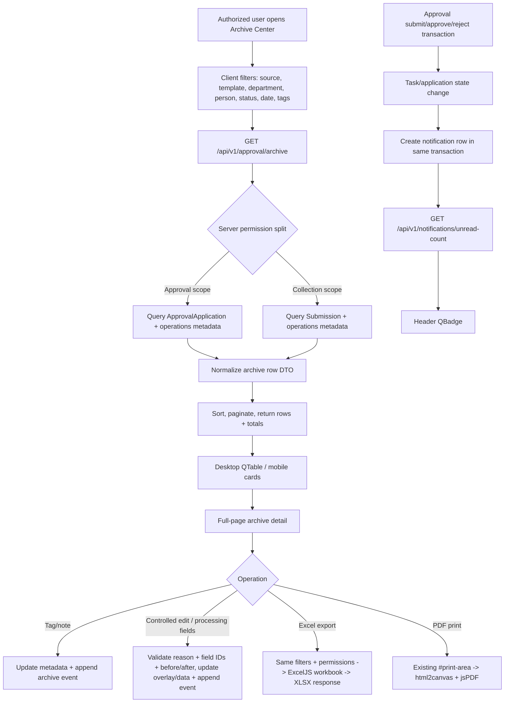

# Phase 19: 收集后处理、归档导出统计 - Research

**Researched:** 2026-04-26  
**Domain:** 审批/收集归档运营、受控编辑、处理字段、Excel 导出、基础统计、站内通知  
**Confidence:** MEDIUM

<user_constraints>
## User Constraints (from CONTEXT.md)

All bullets in this section are copied verbatim from `.planning/phases/19-post-collection-processing-archive-export-stats/19-CONTEXT.md` and are locked for planning [VERIFIED: .planning/phases/19-post-collection-processing-archive-export-stats/19-CONTEXT.md].

### Locked Decisions

#### 归档记录边界与权限
- **D-01:** 归档查询使用 service/query 层聚合 `ApprovalApplication` 和 `Submission`，每条归档结果带 `sourceType`（approval / collection）和源记录 ID；不在 Phase 19 新建统一父记录表，也不强制把公开收集记录迁移成审批申请。
- **D-02:** 归档默认不展示 `DRAFT` 申请；内部审批记录覆盖 `SUBMITTED/APPROVING/APPROVED/REJECTED/CANCELED`，公开收集记录以“已收集”类型进入统一查询。
- **D-03:** 查看范围按现有权限收敛：审批申请使用 `approval:application:department` / `approval:application:all`；公开收集沿用 `form:submission:list`；导出沿用 `approval:export` 并按可见范围裁剪结果。
- **D-04:** Phase 19 可以新增少量运维权限码用于受控编辑、标签/标记和统计，例如 `approval:archive:edit`、`approval:archive:mark`、`approval:archive:stats`；不要复用 `approval:task:handle` 作为归档后处理权限。

#### 标签标记与内部备注
- **D-05:** 标签/标记、内部备注必须作为独立的运营元数据和追加事件保存，不写进 `ApprovalApplication.formData` 或 `Submission.data`，避免污染申请人正式提交内容。
- **D-06:** 首版标签采用自由文本加推荐快捷项的方式，默认推荐 `待跟进`、`已核对`、`资料不全`、`重点`；不做独立标签字典管理或模板级标签后台。
- **D-07:** 标签/标记和备注在归档列表、归档详情、审批任务详情中对授权人员可见；申请人自己的“我的申请”详情继续隐藏内部备注和处理信息，沿用 Phase 18 的 `visibility: INTERNAL` 过滤边界。
- **D-08:** 对审批申请的标记、备注和受控编辑应继续追加 `ApprovalAction` / `ApprovalTimelineEvent`，公共收集记录需要等价的 append-only 审计记录，至少记录操作者、动作、源记录、内容、原因和时间。

#### 受控编辑与处理字段
- **D-09:** 提交后编辑采用“保留原始提交 + 修正覆盖层 + 字段级审计”的语义。内部归档详情和导出可以展示当前有效值，但必须能查看每个被修正字段的 before/after、编辑人、原因和时间。
- **D-10:** 任何提交后编辑都必须填写非空原因；后端拒绝无原因编辑、无权限编辑、非法源记录编辑和无变化编辑。
- **D-11:** 管理员可为模板启用处理字段，处理字段与申请人正式提交字段分开配置、分开存值，默认不进入申请人详情，也不改变 `formData` / `Submission.data`。
- **D-12:** 处理字段首版聚焦运营处理场景，支持文本、多行文本、日期、单选、多选、手机号等轻量字段；签名、动态表格和附件型处理字段不纳入 Phase 19。
- **D-13:** 处理字段值出现在内部归档详情、归档筛选/展示和 Excel 导出中；PDF/打印默认保持申请人正式提交内容，可在内部详情中附加“处理信息”区，但必须清楚区分正式提交和后续处理。

#### 归档查询体验
- **D-14:** 新增统一“归档查询”入口，放在“审批管理”下，与“待我审批”“我的申请”“流程配置”并列；它是授权人员的运营查询页，不替代申请人和审批人的日常入口。
- **D-15:** 桌面端使用可筛选 `q-table`，移动端使用卡片列表和底部筛选 sheet；详情使用全页模式承载长表单、时间线、备注、标签、处理字段和导出动作，不使用窄抽屉承载复杂审批详情。
- **D-16:** 查询筛选必须覆盖模板、部门、申请人/填写者、状态、日期范围、标签/标记和 source type；默认按最近更新时间或完成时间倒序。
- **D-17:** 本阶段不做全文搜索、保存筛选条件、跨字段复杂条件组或高级报表查询。

#### Excel/PDF 导出
- **D-18:** Excel 导出以当前筛选条件和当前用户权限范围为准，导出归档列表数据；导出列包含元信息、状态、部门/人员、标签/标记、处理字段和扁平化后的动态表单字段。
- **D-19:** Excel 列表导出默认不包含完整审计历史；审计历史在单条详情中查看，避免列表文件不可读。
- **D-20:** 单条申请/收集详情的 PDF 和打印复用现有 `#print-area`、`GridFormRenderer mode="print"`、`html2canvas + jsPDF` 路径，继续使用提交时 schema 快照，不改成服务端 PDF。
- **D-21:** Phase 19 不要求新增批量 PDF；已有公开收集批量 PDF 能力可以保留，但本阶段批量数据交付优先满足 Excel。

#### 基础统计
- **D-22:** 统计只做 v2.0 MVP 基础聚合：按模板、状态、部门和月份统计记录数量；可按 source type 区分审批申请和公开收集。
- **D-23:** 统计默认排除草稿；公开收集记录计入“已收集”，审批申请按当前申请状态计入。
- **D-24:** 前端统计可以复用 Dashboard / `FormStatsPanel` 的表格加图表模式；图表库沿用现有 `vue-chartjs`，不引入大型 BI 依赖。
- **D-25:** 字段级统计、金额汇总、漏斗分析、趋势预测、导出统计报表和自定义仪表盘全部延期。

#### 站内通知
- **D-26:** Phase 19 只实现站内通知，不做企业微信、钉钉、短信或邮件。
- **D-27:** 通知事件覆盖新待办、申请通过、申请驳回和未读数量；标签、备注、处理字段和受控编辑默认不发送通知。
- **D-28:** 通知应写入用户级通知记录，包含类型、标题、摘要、关联 source、目标路由、read/unread 和创建时间；点击通知跳转到对应待办详情或申请详情。
- **D-29:** 新待办通知必须跟任务创建事务一致；通过/驳回通知必须跟终态流转一致，避免任务或申请状态已变但通知缺失。
- **D-30:** 首版未读数可通过登录后/页面聚焦/固定间隔轮询刷新，不要求 WebSocket/SSE 实时推送。

### Claude's Discretion
- 具体 Prisma 模型名、路由拆分、DTO 命名、列表列顺序、Excel 库选择、导出行数上限、统计图表样式和空状态文案可由研究和规划阶段按现有项目风格决定。
- 若实现复杂度需要分批，优先顺序应为：数据模型与权限/审计基础 -> 归档查询 -> 标签备注/处理字段 -> 受控编辑 -> Excel/PDF -> 统计 -> 通知。
- UI 视觉应延续现有 Quasar OA 工具风格，保持紧凑、可扫描、移动端可用，不做营销式页面。

### Deferred Ideas (OUT OF SCOPE)
- Enterprise WeChat, DingTalk, SMS and email notification channels.
- Attachment/image/file upload fields and attachment export.
- Full BI/custom dashboard, field-level analytics, amount aggregation and generated reports.
- Dedicated tag taxonomy management, template-level tag dictionaries and tag color governance.
- Unified parent record table replacing `Submission` and `ApprovalApplication`.
- WebSocket/SSE realtime notification delivery.
- Batch PDF for approval archive records beyond the existing collection batch PDF behavior.
</user_constraints>

<phase_requirements>
## Phase Requirements

| ID | Description | Research Support |
|----|-------------|------------------|
| OPS-01 | 授权人员可给申请或收集记录添加标签/标记，如 `待跟进`、`已核对`、`资料不全`、`重点` | Use operational metadata keyed to source records plus append-only archive events; store current tags outside formal submit JSON and filter with PostgreSQL scalar-list support through Prisma [VERIFIED: 19-CONTEXT.md+backend/prisma/schema.prisma][CITED: https://www.prisma.io/docs/orm/prisma-client/special-fields-and-types/working-with-scalar-lists-arrays] |
| OPS-02 | 授权人员可在规则允许时编辑提交后数据，必须填写原因，并记录字段级 before/after 历史 | Keep original `ApprovalApplication.formData` / `Submission.data`, write an edit overlay and field-change event payload in one transaction, and reject missing reason / no-op / unauthorized edits [VERIFIED: 19-CONTEXT.md+backend/src/modules/approval/application.service.ts][CITED: https://www.prisma.io/docs/orm/prisma-client/queries/transactions] |
| OPS-03 | 管理员可为模板启用处理字段，如 `跟进结果`、`处理人备注`、`回访时间`，处理字段默认不改变申请人正式提交内容 | Add template-level processing schema config and per-record processing values in operations metadata; render and export processing values only in internal archive surfaces [VERIFIED: 19-CONTEXT.md+backend/prisma/schema.prisma] |
| OPS-04 | 管理员和授权负责人可按模板、部门、申请人、状态、日期、标签/标记查询归档申请和收集记录 | Build a dedicated `/approval/archive` read service that normalizes `ApprovalApplication` and `Submission` rows into one DTO while preserving per-source permission filtering [VERIFIED: 19-CONTEXT.md+backend/src/modules/submission/submission.route.ts+backend/src/modules/approval/task.service.ts] |
| OPS-05 | 授权人员可导出列表数据为 Excel，并复用现有 PDF/打印能力导出单个申请详情 | Generate Excel server-side with ExcelJS using the same filters and permissions; keep PDF client-side on the existing `#print-area` / `html2canvas + jsPDF` path [VERIFIED: 19-CONTEXT.md+frontend/src/composables/usePdfExport.ts][CITED: https://github.com/exceljs/exceljs][CITED: https://quasar.dev/vue-components/table/] |
| OPS-06 | 管理员可查看按模板、状态、部门和月份聚合的基础统计 | Use Prisma `groupBy` / `findMany` aggregation patterns already present in `form-stats`, merge approval and collection counts in service code, and render table plus Chart.js bars through existing `vue-chartjs` [VERIFIED: backend/src/modules/form-stats/form-stats.route.ts+frontend/src/components/submission/FormStatsPanel.vue][CITED: https://www.prisma.io/docs/orm/prisma-client/queries/aggregation-grouping-summarizing][CITED: https://www.chartjs.org/docs/latest/getting-started/] |
| OPS-07 | 用户可收到站内通知，包括新待办审批、申请通过、申请驳回，并在导航中看到未读数量 | Add a user-scoped notification model/module, write notification rows inside task assignment and terminal transition transactions, and show unread count through a header badge with polling [VERIFIED: 19-CONTEXT.md+backend/src/modules/approval/application.service.ts+frontend/src/layouts/MainLayout.vue][CITED: https://quasar.dev/vue-components/badge/] |
</phase_requirements>

## Project Constraints (from Project Files)

- No project-level `AGENTS.md` or `CLAUDE.md` exists in `E:\webspace\oa`, so there are no additional repository-specific agent directives beyond `.planning/*` and the detected project skill [VERIFIED: local filesystem].
- `.planning/config.json` sets the project stack to Vue 3 + Quasar + TypeScript, Bun + Elysia + Prisma, PostgreSQL, JWT, and Docker Compose [VERIFIED: .planning/config.json].
- The project has one local skill, `.claude/skills/ui-ux-pro-max`, whose relevant constraints are accessibility, 44px touch targets, visible focus, mobile layout safety, and chart/table accessibility [VERIFIED: .claude/skills/ui-ux-pro-max/SKILL.md].
- `workflow.nyquist_validation` is absent from `.planning/config.json`, so validation architecture is enabled by default for this research [VERIFIED: .planning/config.json].

## Summary

Phase 19 should be planned as an operations layer on top of the existing approval and public collection records, not as a replacement data model [VERIFIED: 19-CONTEXT.md+15-CONTEXT.md]. The existing source records remain `ApprovalApplication` for internal approvals and `Submission` for public collection, while Phase 19 adds operational metadata, append-only archive events, processing-field configuration/value storage, notification records, and archive query/export/stat services [VERIFIED: backend/prisma/schema.prisma+19-CONTEXT.md].

The highest-risk areas are permission scoping and audit integrity [VERIFIED: 19-CONTEXT.md]. Archive read/export must combine different permission rules for approval applications and public submissions, controlled edits must preserve original submitted JSON while producing field-level before/after history, and notifications must be created in the same transaction as task assignment or final approval/rejection state changes [VERIFIED: backend/src/modules/approval/application.service.ts+backend/src/middlewares/auth.ts+19-CONTEXT.md].

The current stack is sufficient for Phase 19 if the planner adds only one new dependency: `exceljs` in the backend for XLSX generation [VERIFIED: backend/package.json+frontend/package.json+npm registry]. PDF should not move to the server because the project already has a locked and implemented browser-side `html2canvas + jsPDF` path using `#print-area` and `GridFormRenderer mode="print"` [VERIFIED: frontend/src/composables/usePdfExport.ts+frontend/src/components/submission/SubmissionDetail.vue+13-CONTEXT.md].

**Primary recommendation:** Add a dedicated archive/operations slice under approval: Prisma migration for operations metadata/audit/notifications, `/approval/archive` and `/notifications` backend modules, `approvalArchive` and `notification` frontend stores, a full-page Quasar archive list/detail UI, ExcelJS server export, and transaction-bound notification hooks in `application.service.ts` [VERIFIED: 19-CONTEXT.md+backend/src/index.ts+frontend/src/router/routes.ts].

## Architectural Responsibility Map

| Capability | Primary Tier | Secondary Tier | Rationale | Provenance |
|------------|--------------|----------------|-----------|------------|
| Archive read model | API / Backend | Database / Storage | The server must normalize `ApprovalApplication` and `Submission` rows and apply source-specific visibility before returning rows to the client | [VERIFIED: 19-CONTEXT.md+backend/src/modules/submission/submission.route.ts+backend/src/modules/approval/task.service.ts] |
| Tag/mark current state | Database / Storage | API / Backend | Current tags need indexed/filterable state separate from submitted form JSON, and writes need server normalization and audit events | [VERIFIED: 19-CONTEXT.md][CITED: https://www.prisma.io/docs/orm/prisma-client/special-fields-and-types/working-with-scalar-lists-arrays] |
| Internal notes and archive events | API / Backend | Database / Storage | The backend owns actor identity, source validation, reason enforcement, and append-only event creation | [VERIFIED: backend/src/modules/approval/application.service.ts+19-CONTEXT.md] |
| Controlled edit overlay | API / Backend | Database / Storage | Only the server can compare before/after values, reject no-op edits, and update overlay plus audit in a transaction | [VERIFIED: 19-CONTEXT.md][CITED: https://www.prisma.io/docs/orm/prisma-client/queries/transactions] |
| Processing field configuration | API / Backend | Browser / Client | Admin UI edits config, but backend persists template config and validates processing values against allowed lightweight field types | [VERIFIED: 19-CONTEXT.md+backend/prisma/schema.prisma] |
| Archive list/detail UI | Browser / Client | API / Backend | Quasar owns filters, responsive table/cards, detail layout, and action dialogs; server remains authoritative for data and permissions | [VERIFIED: frontend/src/pages/SubmissionPage.vue+frontend/src/pages/ApprovalTaskDetailPage.vue][CITED: https://quasar.dev/vue-components/table/][CITED: https://quasar.dev/vue-components/dialog] |
| Excel export | API / Backend | Browser / Client | Export must reuse server filters and permissions; browser only triggers download and handles filename/UI state | [VERIFIED: 19-CONTEXT.md][CITED: https://github.com/exceljs/exceljs] |
| PDF/print export | Browser / Client | — | Existing PDF/print implementation is browser-side and must continue using `#print-area` and snapshot rendering | [VERIFIED: frontend/src/composables/usePdfExport.ts+13-CONTEXT.md] |
| Basic stats | API / Backend | Browser / Client | Backend aggregates source records and returns compact datasets; frontend renders table and chart only | [VERIFIED: backend/src/modules/form-stats/form-stats.route.ts+frontend/src/components/submission/FormStatsPanel.vue] |
| In-app notifications | API / Backend | Browser / Client | Backend creates user-scoped records transactionally and computes unread count; frontend polls and displays badge/dropdown | [VERIFIED: 19-CONTEXT.md+backend/src/modules/approval/application.service.ts][CITED: https://quasar.dev/vue-components/badge/] |

## Standard Stack

### Core

| Library | Version | Purpose | Why Standard | Provenance |
|---------|---------|---------|--------------|------------|
| Vue | repo `3.5.12`; npm latest `3.5.33`, registry modified 2026-04-22 | Archive/detail/stats/notification UI | Existing frontend pages and stores are Vue 3 SFCs; Phase 19 should extend that pattern | [VERIFIED: frontend/package.json+npm registry] |
| Quasar | repo `2.17.0`; npm latest `2.19.3`, published 2026-04-06 | QTable, dialogs, badges, responsive cards, mobile bottom sheets | Current OA UI is Quasar, and official QTable/QDialog/QBadge docs cover the needed interactions | [VERIFIED: frontend/package.json+frontend/src/pages/SubmissionPage.vue][CITED: https://quasar.dev/vue-components/table/][CITED: https://quasar.dev/vue-components/dialog][CITED: https://quasar.dev/vue-components/badge/] |
| Pinia | repo `2.2.4`; npm latest `3.0.4`, registry modified 2025-11-05 | Archive and notification stores | Existing approval and submission state use Pinia option stores with async API actions | [VERIFIED: frontend/package.json+frontend/src/stores/approvalTask.ts+frontend/src/stores/submission.ts+npm registry] |
| Elysia | repo `1.1.24`; npm latest `1.4.28`, published 2026-03-16 | Backend route modules and response headers | Existing backend composes Elysia modules under `/api/v1`, and official docs support route guards/groups and response headers | [VERIFIED: backend/package.json+backend/src/index.ts][CITED: https://elysiajs.com/essential/route][CITED: https://elysiajs.com/essential/handler] |
| Prisma / `@prisma/client` | repo `5.22.0`; npm latest `7.8.0`, registry modified 2026-04-23 | Schema migration, transactions, filters, groupBy | Existing approval state, public collection, and stats use Prisma models and query objects; Phase 19 should not introduce raw SQL as the default path | [VERIFIED: backend/package.json+backend/prisma/schema.prisma+backend/src/modules/form-stats/form-stats.route.ts+npm registry][CITED: https://www.prisma.io/docs/orm/prisma-client/queries/transactions][CITED: https://www.prisma.io/docs/orm/prisma-client/queries/filtering-and-sorting] |
| PostgreSQL 16 | Docker image `postgres:16-alpine` | Production datastore and array/JSON support | Docker Compose already defines PostgreSQL 16, and Prisma scalar-list filters for tags are supported on PostgreSQL | [VERIFIED: docker-compose.yml][CITED: https://www.prisma.io/docs/orm/prisma-client/special-fields-and-types/working-with-scalar-lists-arrays] |
| ExcelJS | npm latest `4.4.0`, published 2023-10-19 and registry modified 2024-12-20 | Server-side XLSX generation | ExcelJS supports workbook/worksheet columns, rows, `xlsx.writeBuffer()`, and streaming writer options for larger files | [VERIFIED: npm registry][CITED: https://github.com/exceljs/exceljs] |

### Supporting

| Library | Version | Purpose | When to Use | Provenance |
|---------|---------|---------|-------------|------------|
| html2canvas | repo/latest `1.4.1`, registry modified 2023-07-27 | Existing browser PDF image capture | Use only through current `usePdfExport.ts`; do not add a second PDF path | [VERIFIED: frontend/package.json+frontend/src/composables/usePdfExport.ts+npm registry] |
| jsPDF | repo/latest `4.2.1`, registry modified 2026-03-17 | Existing client PDF generation | Reuse for single-record print/PDF export from archive detail | [VERIFIED: frontend/package.json+frontend/src/composables/usePdfExport.ts+npm registry] |
| vue-chartjs | repo/latest `5.3.3`, registry modified 2025-11-03 | Stats charts | Use for basic bar charts beside a table, matching existing `FormStatsPanel` | [VERIFIED: frontend/package.json+frontend/src/components/submission/FormStatsPanel.vue][CITED: https://vue-chartjs.org/] |
| Chart.js | repo/latest `4.5.1`, registry modified 2025-12-08 | Chart rendering engine | Use registered bar chart components and responsive options already present in the repo | [VERIFIED: frontend/package.json+frontend/src/components/submission/FormStatsPanel.vue][CITED: https://www.chartjs.org/docs/latest/getting-started/] |
| Vitest | repo `0.34.6`; npm latest `4.1.5`, registry modified 2026-04-23 | Frontend store/type/page contract tests | Use for archive store, notification store, type helpers, and source-text UI contracts | [VERIFIED: frontend/package.json+frontend/vitest.config.ts+npm registry] |
| Bun test | local runtime `1.3.12` | Backend service/route tests | Existing backend tests use `bun:test`, so Phase 19 backend tests should stay there | [VERIFIED: backend/src/modules/approval/__tests__/task.service.test.ts+local environment] |

### Alternatives Considered

| Instead of | Could Use | Tradeoff | Provenance |
|------------|-----------|----------|------------|
| ExcelJS server-side XLSX | Client-side `xlsx` / SheetJS | Client-side export would either need all sensitive rows in the browser or duplicate permission logic; `xlsx` latest `0.18.5` is older than ExcelJS latest and is not already installed | [VERIFIED: npm registry+19-CONTEXT.md] |
| Operations metadata keyed to existing sources | New unified parent archive table | A parent table directly contradicts D-01; metadata/audit tables are acceptable only if `ApprovalApplication` and `Submission` remain canonical source records | [VERIFIED: 19-CONTEXT.md+15-CONTEXT.md] |
| Prisma query objects and service merge | Raw SQL `UNION ALL` view | Raw SQL could paginate cross-source records more efficiently, but it raises injection/maintenance risk and is unnecessary for MVP scale unless pagination becomes too slow | [VERIFIED: backend/src/modules/form-stats/form-stats.route.ts][CITED: https://www.prisma.io/docs/orm/prisma-client/queries/filtering-and-sorting] |
| Existing `html2canvas + jsPDF` PDF | Server-side Puppeteer PDF | Server PDF is explicitly outside locked PDF direction and would add deployment/runtime complexity to Bun/Docker | [VERIFIED: 13-CONTEXT.md+19-CONTEXT.md+frontend/src/composables/usePdfExport.ts] |
| Polling notifications | WebSocket/SSE | Real-time push is deferred; polling after login/focus/interval satisfies D-30 with lower operational complexity | [VERIFIED: 19-CONTEXT.md] |

**Installation:**
```bash
cd backend
bun add exceljs
```

**Version verification:** Recommended package versions were checked with `npm view` on 2026-04-26; do not upgrade Vue, Quasar, Prisma, Elysia, Pinia, or test frameworks in this phase unless a separate dependency-upgrade plan is created [VERIFIED: npm registry+frontend/package.json+backend/package.json].

## Architecture Patterns

### System Architecture Diagram



This flow preserves source ownership, keeps permission decisions in the API tier, and keeps PDF export in the browser tier while Excel export stays server-authoritative [VERIFIED: 19-CONTEXT.md+backend/src/index.ts+frontend/src/composables/usePdfExport.ts].

### Recommended Project Structure

```text
backend/src/modules/approval/
├── archive.service.ts                 # archive query, metadata writes, edit overlay, stats/export helpers
├── archive.route.ts                   # /approval/archive routes and serializers
├── notification.service.ts            # transaction-safe notification creation and user queries
├── notification.route.ts              # /notifications user-scoped routes
└── __tests__/
    ├── archive.service.test.ts
    ├── archive.route.test.ts
    ├── archive-export.test.ts
    ├── archive-stats.test.ts
    └── notification.service.test.ts

frontend/src/
├── types/approvalArchive.ts           # source-type DTOs, status labels, export helpers
├── stores/approvalArchive.ts          # list/detail/action/export state
├── stores/notification.ts             # unread count/list/mark-read state
├── pages/ApprovalArchivePage.vue      # responsive archive list
├── pages/ApprovalArchiveDetailPage.vue
├── pages/ApprovalArchiveStatsPage.vue # if stats is separated from archive list
└── stores/__tests__/
    ├── approvalArchive.test.ts
    └── notification.test.ts
```

The file split mirrors current approval modules, route registration, Pinia stores, and Quasar page patterns [VERIFIED: backend/src/modules/approval/task.route.ts+backend/src/modules/approval/task.service.ts+frontend/src/stores/approvalTask.ts+frontend/src/pages/ApprovalTaskPage.vue].

### Pattern 1: Source-Keyed Operations Metadata

**What:** Add operational metadata and events keyed to `ApprovalApplication` or `Submission`, but do not create a new canonical archive parent record [VERIFIED: 19-CONTEXT.md].  
**When to use:** Tags, current mark state, edit overlay, processing values, and audit history for both approval and collection sources [VERIFIED: 19-CONTEXT.md].  
**Recommended shape:**

```prisma
// Source: backend/prisma/schema.prisma and Phase 19 D-01/D-05/D-08.
enum ArchiveSourceType {
  APPROVAL
  COLLECTION
}

enum ArchiveEventType {
  COMMENT
  MARK
  EDIT
  PROCESS_FIELD_UPDATE
}

model ArchiveMetadata {
  id                    Int               @id @default(autoincrement())
  sourceType            ArchiveSourceType
  approvalApplicationId Int?              @unique
  submissionId          Int?              @unique
  tags                  String[]          @default([])
  editOverlay           Json              @default("{}")
  processingData        Json              @default("{}")
  createdAt             DateTime          @default(now())
  updatedAt             DateTime          @updatedAt
  events                ArchiveEvent[]

  @@index([sourceType, updatedAt])
  @@index([tags])
}

model ArchiveEvent {
  id          Int              @id @default(autoincrement())
  metadataId  Int
  metadata    ArchiveMetadata  @relation(fields: [metadataId], references: [id], onDelete: Cascade)
  actorId     Int?
  actorName   String
  type        ArchiveEventType
  reason      String?
  comment     String?
  payload     Json?
  createdAt   DateTime         @default(now())

  @@index([metadataId, createdAt])
  @@index([actorId])
  @@index([type])
}
```

The planner should add a migration-level check or service-level invariant that exactly one source FK is set, because Prisma schema alone will not express that cross-field invariant portably [ASSUMED].

### Pattern 2: Effective Data as Overlay, Not Mutation

**What:** Compute effective internal display/export data as `formalData + editOverlay`, while preserving original `formData` / `data` unchanged [VERIFIED: 19-CONTEXT.md+backend/prisma/schema.prisma].  
**When to use:** Archive detail, archive list preview columns, and Excel export for authorized staff [VERIFIED: 19-CONTEXT.md].  
**Implementation rule:** Accept explicit field changes from the client, validate field IDs against the historical schema snapshot or processing schema, compare before/after server-side, and store field-level changes in the event payload [VERIFIED: 19-CONTEXT.md][CITED: https://www.prisma.io/docs/orm/prisma-client/queries/transactions].

```typescript
// Source: Phase 19 D-09/D-10 plus Prisma transaction docs.
type FieldChange = { fieldId: string; before: unknown; after: unknown };

await prisma.$transaction(async (tx) => {
  const metadata = await getOrCreateArchiveMetadata(tx, source);
  const changes = buildValidatedChanges(snapshotSchema, currentEffectiveData, input.changes);
  if (changes.length === 0) throw new BizError('未检测到字段变化', 400, 'ARCHIVE_EDIT_NO_CHANGE');
  if (!input.reason.trim()) throw new BizError('编辑原因不能为空', 400, 'ARCHIVE_EDIT_REASON_REQUIRED');

  await tx.archiveMetadata.update({
    where: { id: metadata.id },
    data: { editOverlay: mergeOverlay(metadata.editOverlay, changes) },
  });
  await tx.archiveEvent.create({
    data: {
      metadataId: metadata.id,
      actorId: actor.id,
      actorName: actor.name,
      type: 'EDIT',
      reason: input.reason.trim(),
      payload: { changes },
    },
  });
});
```

### Pattern 3: Approval Timeline Bridging

**What:** Approval-source comments, marks, and edits write archive metadata/events and also append `ApprovalAction` / `ApprovalTimelineEvent` using the existing `appendApplicationEvent` pathway [VERIFIED: 19-CONTEXT.md+backend/src/modules/approval/application.service.ts].  
**When to use:** Any operation on `sourceType = APPROVAL` that should appear to authorized internal staff in approval timelines [VERIFIED: 19-CONTEXT.md].  
**Boundary:** Applicant own-detail must continue filtering internal `COMMENT` visibility and should not receive processing fields or archive-only edit overlays [VERIFIED: backend/src/modules/approval/application-submission.service.ts+19-CONTEXT.md].

### Pattern 4: Server-Side XLSX Export

**What:** Add an authenticated export endpoint that applies the same archive filters and visibility logic, flattens metadata/form/processing fields, sanitizes spreadsheet cells, and returns an XLSX response [VERIFIED: 19-CONTEXT.md][CITED: https://github.com/exceljs/exceljs].  
**When to use:** OPS-05 archive list export [VERIFIED: .planning/REQUIREMENTS.md].  
**Example:**

```typescript
// Sources: ExcelJS docs and Elysia response header docs.
const workbook = new ExcelJS.Workbook();
const sheet = workbook.addWorksheet('归档数据');
sheet.columns = columns;
sheet.addRows(rows.map(sanitizeExportRow));
const buffer = await workbook.xlsx.writeBuffer();

return new Response(buffer as BodyInit, {
  headers: {
    'content-type': 'application/vnd.openxmlformats-officedocument.spreadsheetml.sheet',
    'content-disposition': `attachment; filename="${encodeURIComponent(filename)}"`,
  },
});
```

### Pattern 5: Transaction-Bound Notifications

**What:** Create notification rows in the same Prisma transaction that creates a task or finalizes approval/rejection [VERIFIED: 19-CONTEXT.md+backend/src/modules/approval/application.service.ts].  
**When to use:** New pending task, applicant approval pass, applicant rejection [VERIFIED: 19-CONTEXT.md].  
**Implementation rule:** Add `createNotification(tx, input)` helper that accepts the active transaction client; do not create notifications after the workflow transaction returns [VERIFIED: 19-CONTEXT.md][CITED: https://www.prisma.io/docs/orm/prisma-client/queries/transactions].

### Anti-Patterns to Avoid

- **Unified archive parent record:** This violates D-01 and creates a migration burden that Phase 19 explicitly avoids [VERIFIED: 19-CONTEXT.md].
- **Writing tags or processing values into submitted JSON:** This violates D-05/D-11 and makes applicant-facing data ambiguous [VERIFIED: 19-CONTEXT.md].
- **Client-side permission filtering before Excel export:** Export must be server-side because the browser cannot be trusted to scope sensitive rows [VERIFIED: backend/src/middlewares/auth.ts+19-CONTEXT.md].
- **Route-level direct workflow mutations:** Notifications and final states must reuse existing approval transaction primitives or helpers around them [VERIFIED: backend/src/modules/approval/application.service.ts].
- **Manual chart rendering:** Use existing `vue-chartjs` / Chart.js and keep a table alternative for exact values [VERIFIED: frontend/src/components/submission/FormStatsPanel.vue][CITED: https://www.chartjs.org/docs/latest/getting-started/].

## Don't Hand-Roll

| Problem | Don't Build | Use Instead | Why | Provenance |
|---------|-------------|-------------|-----|------------|
| XLSX file creation | Manual XML/ZIP or CSV pretending to be Excel | ExcelJS | XLSX packaging, worksheet columns, rows, buffers, and streaming are already solved | [CITED: https://github.com/exceljs/exceljs][VERIFIED: npm registry] |
| PDF generation | New server PDF renderer | Existing `usePdfExport.ts` with html2canvas + jsPDF | Locked project path preserves grid/PDF fidelity and avoids new server dependencies | [VERIFIED: 13-CONTEXT.md+frontend/src/composables/usePdfExport.ts] |
| Access control | Frontend-only `v-perm` checks | `authGuard()` plus service-level source visibility checks | Backend already centralizes JWT and permissions; archive combines multiple scopes that the server must enforce | [VERIFIED: backend/src/middlewares/auth.ts+19-CONTEXT.md] |
| Audit history | Mutable JSON log array | Append-only `ArchiveEvent` plus existing `ApprovalAction` / `ApprovalTimelineEvent` for approvals | Append-only records preserve actor, reason, payload, and time for dispute tracing | [VERIFIED: 19-CONTEXT.md+backend/src/modules/approval/application.service.ts] |
| Form rendering | Custom archive-only form renderer | `GridFormRenderer mode="print"` | Existing details already render historical schema snapshots correctly | [VERIFIED: frontend/src/components/submission/SubmissionDetail.vue+frontend/src/pages/ApprovalTaskDetailPage.vue] |
| Stats charting | Custom canvas/SVG chart code | vue-chartjs + Chart.js | Existing stats panel already uses registered Chart.js components and accessible table+chart layout | [VERIFIED: frontend/src/components/submission/FormStatsPanel.vue][CITED: https://vue-chartjs.org/] |
| Notification realtime | WebSocket/SSE service | Polling unread count store | D-30 explicitly defers realtime push | [VERIFIED: 19-CONTEXT.md] |

**Key insight:** Phase 19 is mostly about preserving trust boundaries: original submission data, operational overlays, audit events, export scope, and notification delivery must stay separate even when shown together in one archive UI [VERIFIED: 19-CONTEXT.md+backend/prisma/schema.prisma].

## Common Pitfalls

### Pitfall 1: Accidentally Creating a New Canonical Archive Table

**What goes wrong:** A new `ArchiveRecord` becomes the source of truth and forces migration or duplication of `ApprovalApplication` and `Submission` semantics [VERIFIED: 19-CONTEXT.md+15-CONTEXT.md].  
**Why it happens:** Unified UI tempts developers to unify persistence as well [ASSUMED].  
**How to avoid:** Add only operational metadata/audit tables keyed to the existing source records, and build the archive row as a service DTO [VERIFIED: 19-CONTEXT.md].  
**Warning signs:** The migration stores applicant, submitter, status, template, and form data redundantly as canonical archive columns [VERIFIED: backend/prisma/schema.prisma].

### Pitfall 2: Polluting Formal Submitted Data

**What goes wrong:** Tags, marks, notes, processing values, or corrected values are written into `ApprovalApplication.formData` or `Submission.data` [VERIFIED: 19-CONTEXT.md].  
**Why it happens:** JSON fields are easy to mutate and already render in form detail components [VERIFIED: backend/prisma/schema.prisma+frontend/src/components/submission/SubmissionDetail.vue].  
**How to avoid:** Keep formal submit JSON immutable after submit, write overlays/processing data separately, and compute internal effective data only for authorized archive views [VERIFIED: 19-CONTEXT.md].  
**Warning signs:** Applicant own-detail starts showing processing fields or internal correction values [VERIFIED: backend/src/modules/approval/application-submission.service.ts+19-CONTEXT.md].

### Pitfall 3: Controlled Edits Without Server-Side Before/After

**What goes wrong:** The UI sends a reason and new value, but the backend does not compute reliable before/after values or reject no-op edits [VERIFIED: 19-CONTEXT.md].  
**Why it happens:** Field comparison is treated as a UI concern [ASSUMED].  
**How to avoid:** The service must load current effective data, validate field IDs, compare values, require non-empty reason, update overlay, and append event in one transaction [VERIFIED: 19-CONTEXT.md][CITED: https://www.prisma.io/docs/orm/prisma-client/queries/transactions].  
**Warning signs:** Route handlers accept arbitrary JSON patch payloads without schema-aware field validation [VERIFIED: backend/src/modules/approval/task.route.ts].

### Pitfall 4: Cross-Source Permission Drift

**What goes wrong:** Users with collection access see approval records, or users with approval department scope export all public submissions [VERIFIED: 19-CONTEXT.md].  
**Why it happens:** One archive endpoint hides that source records have different existing permissions [VERIFIED: backend/prisma/seed.ts+backend/src/middlewares/auth.ts].  
**How to avoid:** Build a `resolveArchiveVisibility(currentUser)` function and apply it before every list/detail/export/stat query [VERIFIED: 19-CONTEXT.md].  
**Warning signs:** `authGuard('approval:export')` is the only guard on export without row-level source filtering [VERIFIED: backend/src/middlewares/auth.ts].

### Pitfall 5: Excel Formula Injection

**What goes wrong:** A submitted text value beginning with formula-trigger characters executes as a spreadsheet formula when opened in Excel or compatible tools [CITED: https://owasp.org/www-community/attacks/CSV_Injection].  
**Why it happens:** Export code treats dynamic form text as safe display text [ASSUMED].  
**How to avoid:** Sanitize every text cell for formula-leading characters such as `=`, `+`, `-`, `@`, tab, carriage return, line feed, and full-width variants before adding rows to ExcelJS [CITED: https://owasp.org/www-community/attacks/CSV_Injection].  
**Warning signs:** Export helper passes raw `formData` strings directly into worksheet rows [CITED: https://github.com/exceljs/exceljs].

### Pitfall 6: Notifications Created Outside Workflow Transactions

**What goes wrong:** A task is created but no new-todo notification exists, or an approval reaches a terminal state but applicant notification is missing [VERIFIED: 19-CONTEXT.md].  
**Why it happens:** Notification write is done after `submitApplication`, `approveTask`, or `rejectTask` returns [VERIFIED: backend/src/modules/approval/application.service.ts].  
**How to avoid:** Add notification writes to the same transaction block where tasks/final state are created [VERIFIED: 19-CONTEXT.md][CITED: https://www.prisma.io/docs/orm/prisma-client/queries/transactions].  
**Warning signs:** Notification service accepts only the global Prisma client and cannot accept a transaction client [VERIFIED: backend/src/modules/approval/application.service.ts].

### Pitfall 7: Basic Stats Count Drafts or Double-Count Sources

**What goes wrong:** Stats include `DRAFT` applications or mix collection and approval statuses under ambiguous labels [VERIFIED: 19-CONTEXT.md].  
**Why it happens:** Existing form stats only count submissions and do not have approval statuses [VERIFIED: backend/src/modules/form-stats/form-stats.route.ts].  
**How to avoid:** Exclude `DRAFT`, map collection rows to a stable `COLLECTED` status, and include `sourceType` in stats payloads [VERIFIED: 19-CONTEXT.md].  
**Warning signs:** Stats service groups `ApprovalApplication` by status without a `where: { status: { not: 'DRAFT' } }` equivalent [VERIFIED: backend/prisma/schema.prisma].

## Code Examples

Verified patterns from official sources and the current codebase:

### Spreadsheet Cell Sanitization

```typescript
// Sources: OWASP CSV Injection and ExcelJS export docs.
const FORMULA_LEADING = /^[=+\-@\t\r\n\uFF1D\uFF0B\uFF0D\uFF20]/u;

export function safeExcelValue(value: unknown): unknown {
  if (typeof value !== 'string') return value;
  return FORMULA_LEADING.test(value) ? `'${value}` : value;
}
```

### Source Visibility Guard

```typescript
// Source: backend/src/middlewares/auth.ts and Phase 19 D-03.
function hasPerm(user: CurrentUser, code: string) {
  return user.roleCodes.includes('ADMIN') || user.permissions.includes(code);
}

function resolveArchiveVisibility(user: CurrentUser) {
  return {
    approvalAll: hasPerm(user, 'approval:application:all'),
    approvalDepartment: hasPerm(user, 'approval:application:department'),
    collection: hasPerm(user, 'form:submission:list'),
    export: hasPerm(user, 'approval:export'),
  };
}
```

### Quasar Archive Table Contract

```vue
<!-- Sources: frontend/src/pages/SubmissionPage.vue and Quasar QTable docs. -->
<q-table
  :rows="store.rows"
  :columns="columns"
  row-key="archiveKey"
  :loading="store.loading"
  v-model:pagination="pagination"
  :rows-per-page-options="[10, 20, 50]"
  flat
  bordered
  dense
  @request="onRequest"
/>
```

### Notification Badge

```vue
<!-- Source: Quasar QBadge docs and frontend/src/layouts/MainLayout.vue. -->
<q-btn flat round dense icon="notifications" aria-label="站内通知">
  <q-badge v-if="notification.unreadCount > 0" color="red" floating>
    {{ notification.unreadCount > 99 ? '99+' : notification.unreadCount }}
  </q-badge>
</q-btn>
```

## State of the Art

| Old Approach | Current Approach | When Changed | Impact | Provenance |
|--------------|------------------|--------------|--------|------------|
| CSV-only list export | XLSX workbook generation with a library | Current ExcelJS docs and Phase 19 requirements | Use ExcelJS for `.xlsx`; still sanitize formulas because spreadsheet formula risks apply to exported cell values | [CITED: https://github.com/exceljs/exceljs][CITED: https://owasp.org/www-community/attacks/CSV_Injection] |
| One record type for archive | Query-layer aggregation over source records | Locked by Phases 15 and 19 | Plan services and DTOs around `sourceType + sourceId` rather than migrating both sources | [VERIFIED: 15-CONTEXT.md+19-CONTEXT.md] |
| Applicant-visible detail as the only detail route | Separate internal archive detail and applicant own-detail | Locked by Phase 18 visibility filtering and Phase 19 internal data requirements | Internal detail may show tags, notes, processing fields, and edit history; applicant detail must not | [VERIFIED: backend/src/modules/approval/application-submission.service.ts+19-CONTEXT.md] |
| Major dependency upgrades during feature work | Keep repo versions stable and add only `exceljs` | npm registry checked 2026-04-26 | Avoid mixing Phase 19 business behavior with Prisma 5->7, Elysia 1.1->1.4, Pinia 2->3, or Vue Router 4->5 migration risk | [VERIFIED: backend/package.json+frontend/package.json+npm registry] |

**Deprecated/outdated:**

- Treating `Submission` as the approval application storage path is outdated for v2.0 because Phases 15-19 explicitly keep public collection and internal approval as separate source records [VERIFIED: 15-CONTEXT.md+19-CONTEXT.md].
- Using server-side PDF generation is out of date for this repo because Phase 13 locked the browser-side `html2canvas + jsPDF` path and Phase 19 reuses it [VERIFIED: 13-CONTEXT.md+19-CONTEXT.md].

## Assumptions Log

| # | Claim | Section | Risk if Wrong |
|---|-------|---------|---------------|
| A1 | Prisma cannot portably express the exact-one-of-two-source-FKs invariant by schema alone, so planner should enforce it in service code or migration SQL | Architecture Patterns / Pattern 1 | Medium; a weak invariant could allow malformed metadata rows unless service tests cover it |
| A2 | The most likely reason developers pollute form JSON is convenience rather than a product requirement | Common Pitfalls / Pitfall 2 | Low; mitigation is still required by locked decisions |
| A3 | Route handlers may be tempted to accept arbitrary JSON patch payloads for edits | Common Pitfalls / Pitfall 3 | Medium; planner should write route contract tests to prevent this |

## Open Questions (RESOLVED)

1. **What export row cap should Phase 19 enforce?**
   - What we know: Row cap is left to Claude's discretion, and Excel export must use current filters and permissions [VERIFIED: 19-CONTEXT.md].
   - What's unclear: No existing product requirement defines a maximum row count [VERIFIED: .planning/REQUIREMENTS.md].
   - RESOLVED: Phase 19 plans use an MVP cap of 2,000 rows for list export and require a clear error if filters match more. Raise later only after measuring memory/time with ExcelJS [ASSUMED].

2. **Should processing field config changes be versioned?**
   - What we know: Formal submit schema is versioned and historical forms use snapshots, but Phase 19 only says processing fields are separate and internal [VERIFIED: 16-CONTEXT.md+19-CONTEXT.md].
   - What's unclear: No locked decision requires processing-schema version snapshots [VERIFIED: 19-CONTEXT.md].
   - RESOLVED: Phase 19 plans keep processing config on the template without bumping formal `schemaVersion`; historical processing values are preserved by key in `processingData`, and unknown keys must display defensively [ASSUMED].

## Environment Availability

| Dependency | Required By | Available | Version | Fallback | Provenance |
|------------|-------------|-----------|---------|----------|------------|
| Bun | Backend runtime/tests/dependency install | ✓ | `1.3.12` | — | [VERIFIED: local environment+backend/package.json] |
| Node.js | Frontend tooling and npm registry checks | ✓ | `v22.20.0` | — | [VERIFIED: local environment+frontend/package.json] |
| npm | Registry verification and frontend scripts | ✓ | `10.9.3` | — | [VERIFIED: local environment] |
| Docker CLI | Project-standard services | CLI ✓, daemon ✗ | CLI `29.4.0` | Start Docker Desktop before DB-backed verification | [VERIFIED: local environment+docker-compose.yml] |
| PostgreSQL | Prisma migrations and backend integration tests | ✗ locally listening | Docker image `postgres:16-alpine` configured | Start Docker daemon and `docker compose up -d postgres`, or provide a reachable `DATABASE_URL` | [VERIFIED: docker-compose.yml+local port 5432 probe] |
| `pg_isready` host CLI | Optional DB readiness probe | ✗ | — | Use Docker healthcheck or `docker exec oa-postgres pg_isready` after Docker is running | [VERIFIED: local environment+docker-compose.yml] |
| ExcelJS package | OPS-05 Excel export | ✗ installed; ✓ registry | latest `4.4.0` | Install with `cd backend && bun add exceljs` | [VERIFIED: backend/package.json+npm registry] |
| Git | Optional research commit | ✓ | `2.47.1.windows.1` | — | [VERIFIED: local environment] |

**Missing dependencies with no fallback:**
- A running PostgreSQL service is required before DB-backed Prisma tests and migrations can pass; Docker CLI is installed but the Docker daemon was not running during research [VERIFIED: local environment+docker-compose.yml].

**Missing dependencies with fallback:**
- Host `pg_isready` is missing; Dockerized PostgreSQL includes the readiness check once Docker Desktop is running [VERIFIED: local environment+docker-compose.yml].
- ExcelJS is not installed yet; `bun add exceljs` is the planned package step [VERIFIED: backend/package.json+npm registry].

## Validation Architecture

### Test Framework

| Property | Value |
|----------|-------|
| Framework | Backend: Bun test; Frontend: Vitest `0.34.6` with `happy-dom` | [VERIFIED: backend/src/modules/approval/__tests__/task.service.test.ts+frontend/package.json+frontend/vitest.config.ts] |
| Config file | Frontend: `frontend/vitest.config.ts`; Backend: none, Bun built-in runner | [VERIFIED: frontend/vitest.config.ts+backend/src/modules/approval/__tests__/task.service.test.ts] |
| Quick run command | `cd backend && bun test src/modules/approval/__tests__/archive.service.test.ts src/modules/approval/__tests__/archive.route.test.ts src/modules/approval/__tests__/notification.service.test.ts && cd ../frontend && npm test -- src/stores/__tests__/approvalArchive.test.ts src/stores/__tests__/notification.test.ts src/types/__tests__/approvalArchive.test.ts` | [ASSUMED] |
| Full suite command | `cd backend && bun test && bun run build && cd ../frontend && npm test && npm run build` | [ASSUMED] |

### Phase Requirements -> Test Map

| Req ID | Behavior | Test Type | Automated Command | File Exists? |
|--------|----------|-----------|-------------------|--------------|
| OPS-01 | Tags/marks add/remove/filter for approval and collection sources with audit event | backend service/route + frontend store | `cd backend && bun test src/modules/approval/__tests__/archive.service.test.ts src/modules/approval/__tests__/archive.route.test.ts` | ❌ Wave 0 |
| OPS-02 | Controlled edit requires reason, rejects no-op/unauthorized source, records field before/after | backend service/route | `cd backend && bun test src/modules/approval/__tests__/archive.service.test.ts` | ❌ Wave 0 |
| OPS-03 | Template processing fields config and per-record processing values stay separate from formal submit data | backend route/service + frontend type/store | `cd backend && bun test src/modules/approval/__tests__/archive.service.test.ts && cd ../frontend && npm test -- src/types/__tests__/approvalArchive.test.ts` | ❌ Wave 0 |
| OPS-04 | Archive list/detail filters template, department, person, status, date, tags, source type under permissions | backend service/route + frontend store | `cd backend && bun test src/modules/approval/__tests__/archive.route.test.ts && cd ../frontend && npm test -- src/stores/__tests__/approvalArchive.test.ts` | ❌ Wave 0 |
| OPS-05 | Excel export reuses filters/permissions and single detail PDF reuses print-area path | backend export + frontend page contract | `cd backend && bun test src/modules/approval/__tests__/archive-export.test.ts && cd ../frontend && npm test -- src/pages/__tests__/ApprovalArchiveDetailPage.test.ts` | ❌ Wave 0 |
| OPS-06 | Stats exclude drafts and aggregate by template/status/department/month/source type | backend stats + frontend chart/store | `cd backend && bun test src/modules/approval/__tests__/archive-stats.test.ts && cd ../frontend && npm test -- src/stores/__tests__/approvalArchive.test.ts` | ❌ Wave 0 |
| OPS-07 | New task/pass/reject notifications are transaction-bound and unread count is user-scoped | backend service + frontend store/layout contract | `cd backend && bun test src/modules/approval/__tests__/notification.service.test.ts && cd ../frontend && npm test -- src/stores/__tests__/notification.test.ts src/layouts/__tests__/MainLayoutNotification.test.ts` | ❌ Wave 0 |

### Sampling Rate

- **Per task commit:** Run the focused backend tests for the touched service/route plus the matching frontend store/type tests [VERIFIED: repo test patterns in backend/src/modules/approval/__tests__ and frontend/src/stores/__tests__].
- **Per wave merge:** Run all new Phase 19 backend tests, all new Phase 19 frontend tests, and approval regression tests around application/task services [VERIFIED: backend/src/modules/approval/__tests__/application.service.test.ts+backend/src/modules/approval/__tests__/task.service.test.ts].
- **Phase gate:** Full backend/frontend test and build pass before `/gsd-verify-work` [ASSUMED].

### Wave 0 Gaps

- [ ] `backend/src/modules/approval/__tests__/archive.service.test.ts` - metadata model, permissions, tag/note/edit/processing-field service behavior
- [ ] `backend/src/modules/approval/__tests__/archive.route.test.ts` - route prefix, body schemas, serialization, forbidden trusted fields
- [ ] `backend/src/modules/approval/__tests__/archive-export.test.ts` - Excel columns, cell sanitization, row cap, permission reuse
- [ ] `backend/src/modules/approval/__tests__/archive-stats.test.ts` - group counts, draft exclusion, collection status mapping
- [ ] `backend/src/modules/approval/__tests__/notification.service.test.ts` - task/final-state notifications and unread count scope
- [ ] `frontend/src/types/__tests__/approvalArchive.test.ts` - labels, source/status helpers, payload key guardrails
- [ ] `frontend/src/stores/__tests__/approvalArchive.test.ts` - list/detail/actions/export endpoints and loading states
- [ ] `frontend/src/stores/__tests__/notification.test.ts` - unread count/list/mark-read polling actions
- [ ] `frontend/src/pages/__tests__/ApprovalArchiveDetailPage.test.ts` - full-page detail contract, print-area reuse, internal processing separation

## Security Domain

### Applicable ASVS Categories

The ASVS category labels below follow the OWASP Developer Guide's ASVS section list [CITED: https://devguide.owasp.org/en/08-culture-process/04-asvs/].

| ASVS Category | Applies | Standard Control | Provenance |
|---------------|---------|------------------|------------|
| V2 Authentication | yes | All archive/export/stats/notification routes require authenticated JWT context through existing auth middleware | [VERIFIED: backend/src/middlewares/auth.ts+backend/src/index.ts] |
| V3 Session Management | yes | Existing access/refresh JWT stack remains unchanged; notification polling uses authenticated API calls | [VERIFIED: backend/src/index.ts+frontend/src/boot/axios.ts] |
| V4 Access Control | yes | Source-specific archive visibility, export row scoping, edit/mark/stats permissions, and user-scoped notifications | [VERIFIED: 19-CONTEXT.md+backend/prisma/seed.ts+backend/src/middlewares/auth.ts] |
| V5 Validation, Sanitization and Encoding | yes | TypeBox request schemas, required edit reasons, field ID validation, tag length normalization, date parsing, and Excel cell sanitization | [VERIFIED: backend/src/modules/approval/task.route.ts+19-CONTEXT.md][CITED: https://owasp.org/www-community/attacks/CSV_Injection] |
| V6 Stored Cryptography | no new crypto | Continue existing JWT/bcrypt libraries; Phase 19 must not introduce custom crypto | [VERIFIED: backend/package.json+backend/src/index.ts+backend/prisma/seed.ts] |

### Known Threat Patterns for Vue/Quasar + Elysia + Prisma Archive Operations

| Pattern | STRIDE | Standard Mitigation | Provenance |
|---------|--------|---------------------|------------|
| IDOR on archive source IDs | Elevation of Privilege / Information Disclosure | Resolve source record server-side and apply `approval:application:*` / `form:submission:list` scope before detail/action/export | [VERIFIED: 19-CONTEXT.md+backend/src/middlewares/auth.ts] |
| Over-posting trusted fields | Tampering | Body schemas accept only operation payloads; actor/source metadata come from JWT and DB lookup | [VERIFIED: backend/src/modules/approval/task.route.ts+backend/src/modules/approval/__tests__/task.route.test.ts] |
| Audit tampering | Repudiation / Tampering | Append archive events; do not update/delete historical events through normal APIs | [VERIFIED: 19-CONTEXT.md+backend/src/modules/approval/application.service.ts] |
| Spreadsheet formula injection | Tampering / Information Disclosure | Sanitize text cells before ExcelJS row insertion | [CITED: https://owasp.org/www-community/attacks/CSV_Injection] |
| Notification data leakage | Information Disclosure | Query notifications by `userId = currentUser.id`; never accept target user from client for read/mark-read | [VERIFIED: 19-CONTEXT.md+backend/src/middlewares/auth.ts] |
| Export denial of service | Denial of Service | Enforce export row cap and avoid unbounded ExcelJS in-memory workbook generation | [CITED: https://github.com/exceljs/exceljs][ASSUMED] |
| Applicant visibility leak | Information Disclosure | Keep applicant own-detail serializer filtering internal `COMMENT` payloads and exclude processing/edit overlays | [VERIFIED: backend/src/modules/approval/application-submission.service.ts+19-CONTEXT.md] |

## Sources

### Primary (HIGH confidence)

- `.planning/phases/19-post-collection-processing-archive-export-stats/19-CONTEXT.md` - locked Phase 19 scope, decisions, out-of-scope boundaries
- `.planning/REQUIREMENTS.md` - OPS-01 through OPS-07 requirement text
- `.planning/ROADMAP.md` - Phase 19 goal, dependency, success criteria
- `.planning/PROJECT.md` - stack, constraints, v2.0 milestone framing
- `.planning/research/CLIENT_CHAT_NEXT_FEATURES.md` - client-derived archive/export/stats/notification context
- `.planning/phases/15-approval-data-model-state-machine/15-CONTEXT.md` - separate `ApprovalApplication` and `Submission` source ownership
- `.planning/phases/16-process-config-template-binding/16-CONTEXT.md` - approval permissions and schema-version decisions
- `.planning/phases/17-my-applications-dynamic-submission/17-PATTERNS.md` - approval application route/store/detail patterns
- `.planning/phases/18-approval-task-inbox-mobile-approval/18-PATTERNS.md` - approval task route/store/detail/mobile patterns
- `.planning/milestones/v1.1-phases/09-data-view-print-stats/09-CONTEXT.md` - existing submission list, print/PDF, stats decisions
- `.planning/milestones/v1.2-phases/13-pdf/13-CONTEXT.md` - locked PDF path
- `backend/prisma/schema.prisma` - current approval, submission, permission schema
- `backend/src/modules/approval/application.service.ts` - transaction primitives and `appendApplicationEvent`
- `backend/src/modules/approval/task.service.ts` - internal comment and task serialization precedent
- `backend/src/modules/approval/application-submission.service.ts` - applicant-side internal comment filtering
- `backend/src/modules/submission/submission.route.ts` - collection list/detail query precedent
- `backend/src/modules/form-stats/form-stats.route.ts` - current Prisma aggregation pattern
- `frontend/src/pages/SubmissionPage.vue` - existing QTable/filter/PDF flow
- `frontend/src/composables/usePdfExport.ts` - existing PDF implementation
- `frontend/src/components/submission/FormStatsPanel.vue` - existing table plus chart stats UI
- `frontend/src/layouts/MainLayout.vue` and `frontend/src/router/routes.ts` - menu/route permission integration
- npm registry via `npm view` - current package versions and registry dates
- Prisma docs: https://www.prisma.io/docs/orm/prisma-client/queries/transactions
- Prisma filtering docs: https://www.prisma.io/docs/orm/prisma-client/queries/filtering-and-sorting
- Prisma groupBy docs: https://www.prisma.io/docs/orm/prisma-client/queries/aggregation-grouping-summarizing
- Prisma scalar lists docs: https://www.prisma.io/docs/orm/prisma-client/special-fields-and-types/working-with-scalar-lists-arrays
- Elysia route/guard/header docs: https://elysiajs.com/essential/route and https://elysiajs.com/essential/handler
- Quasar QTable docs: https://quasar.dev/vue-components/table/
- Quasar Dialog docs: https://quasar.dev/vue-components/dialog
- Quasar Badge docs: https://quasar.dev/vue-components/badge/
- ExcelJS README/docs: https://github.com/exceljs/exceljs
- Chart.js docs: https://www.chartjs.org/docs/latest/getting-started/
- vue-chartjs docs: https://vue-chartjs.org/
- OWASP CSV Injection: https://owasp.org/www-community/attacks/CSV_Injection
- OWASP ASVS guide: https://devguide.owasp.org/en/08-culture-process/04-asvs/

### Secondary (MEDIUM confidence)

- `.claude/skills/ui-ux-pro-max/SKILL.md` - project skill UI/accessibility patterns
- Local environment probes - runtime/tool availability on 2026-04-26

### Tertiary (LOW confidence)

- Assumptions A1-A3 in the Assumptions Log

## Metadata

**Confidence breakdown:**

- Standard stack: HIGH - Existing stack verified in package files and npm registry; only new dependency is ExcelJS, verified through npm and official docs [VERIFIED: backend/package.json+frontend/package.json+npm registry][CITED: https://github.com/exceljs/exceljs].
- Architecture: MEDIUM - Locked source boundaries and code patterns are clear, but exact operations metadata model is still a planning recommendation under Claude's discretion [VERIFIED: 19-CONTEXT.md].
- Pitfalls: HIGH - Major risks are directly tied to locked decisions, existing serializer/transaction code, and OWASP export guidance [VERIFIED: 19-CONTEXT.md+backend/src/modules/approval/application.service.ts][CITED: https://owasp.org/www-community/attacks/CSV_Injection].
- Environment: MEDIUM - Required CLIs are mostly available, but Docker daemon/PostgreSQL were not running during research [VERIFIED: local environment+docker-compose.yml].

**Research date:** 2026-04-26  
**Valid until:** 2026-05-26 for repo architecture and Phase 19 scope; re-check npm registry and Docker/PostgreSQL availability before implementation [VERIFIED: current research session].
